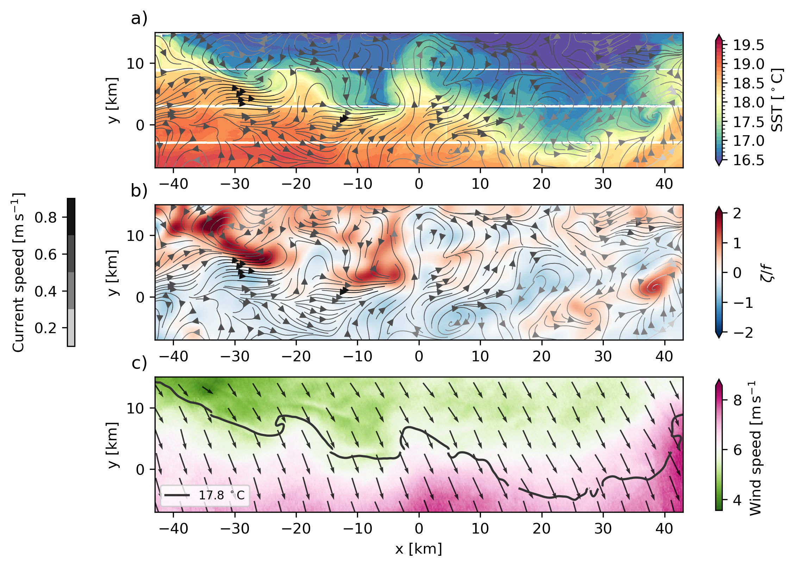

# Sub-Mesoscale Ocean Dynamics Experiment (S-MODE) - BAMS Paper

This repository contains the code for generating Figure 10 from the Sub-Mesoscale Ocean Dynamics Experiment (S-MODE) paper published in the *Bulletin of the American Meteorological Society* (BAMS).
The code serves as an example for accessing, downloading, processing, and visualizing S-MODE data.

## Overview

The S-MODE project aims to study how small-scale (sub-mesoscale) ocean dynamics contribute to vertical exchange in the upper ocean.

Figure 10 from the paper showcases various oceanographic and meteorological data collected as part of the S-MODE field campaign. 

The provided code (`src/dopplerscatt_moses/`) walks through the steps needed to reproduce this figure, including data retrieval, processing, and visualization using Python.
It illustrates how to integrate different datasets such as sea surface temperature (SST), surface currents, and wind data to reveal the interaction between these elements at the sub-mesoscale level.

- **Panel (a)**: SST on 24 October 2022 from the MOSES infrared imager (colors), with ocean current streamlines collected simultaneously with the DopplerScatt instrument (grayscale lines). Note the close agreement between SST and velocity structures
- **Panel (b)**:  Ocean vorticity estimated from the DopplerScatt surface currents at 2km resolution. This is one of the first synoptic maps of ocean vorticity for testing the fidelity of model vorticity estimates
- **Panel (c)**: Surface wind vectors and wind speed (colors)and the 17.8◦C isotherm from the MOSES infrared imager (black line). There is a close correspondence between wind speed and SST, suggesting that the submesoscale SST variations are driving wind speed variations.
